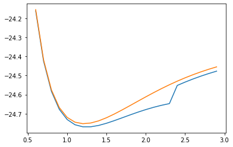

```python
from qiskit import BasicAer, Aer, IBMQ
from qiskit.aqua import QuantumInstance, aqua_globals
from qiskit.aqua.algorithms import VQE, ExactEigensolver,NumPyMinimumEigensolver
from qiskit.aqua.components.initial_states import Zero
from qiskit.aqua.components.optimizers import COBYLA, L_BFGS_B, SLSQP, SPSA
from qiskit.aqua.components.variational_forms import RY, RYRZ, SwapRZ
from qiskit.aqua.operators import WeightedPauliOperator, Z2Symmetries
from qiskit.chemistry import FermionicOperator
from qiskit.chemistry.drivers import PySCFDriver, UnitsType
from qiskit.chemistry.components.variational_forms import UCCSD
from qiskit.chemistry.components.initial_states import HartreeFock

from qiskit.providers.aer import QasmSimulator
from qiskit.providers.aer.noise import NoiseModel
from qiskit.providers.aer.noise.errors import QuantumError, ReadoutError
from qiskit.providers.aer.noise.errors import pauli_error
from qiskit.providers.aer.noise.errors import depolarizing_error
from qiskit.providers.aer.noise.errors import thermal_relaxation_error

from qiskit.providers.aer import noise
#provider = IBMQ.load_account()

import numpy as np
import matplotlib.pyplot as plt
from functools import partial
```

## Defining our molecule 


```python
molecule = PySCFDriver(atom='B .0 .0 .0; H .0 .0 1.2', unit=UnitsType.ANGSTROM,
                     charge=0, spin=0, basis='sto3g').run()


```

## to reduce the computational power we reduce the problem size by removing and freezing some orbitals of the inner shells before we make the transformation from fermionic to qubit hamiltonian.. we also choose the parity mapping for the same reason


```python
freeze_list = [0]
remove_list = [-3, -2] 
map_type='parity'
remove_list = [x % molecule.num_orbitals for x in remove_list]
freeze_list = [x % molecule.num_orbitals for x in freeze_list]
remove_list = [x - len(freeze_list) for x in remove_list]
remove_list += [x + molecule.num_orbitals - len(freeze_list)  for x in remove_list]
freeze_list += [x + molecule.num_orbitals for x in freeze_list]

```

## we call other properties of the molecule 


```python
h1=molecule.one_body_integrals
h2=molecule.two_body_integrals
num_of_particles=molecule.num_alpha+molecule.num_beta
num_of_spin_orbitals=molecule.num_orbitals *2
nuclear_repulsion_energy=molecule.nuclear_repulsion_energy
HF_energy=molecule.hf_energy-nuclear_repulsion_energy
energy_shift=0
print("The energy:{}". format(HF_energy))
print("Number of spin orbitals: {}".format(num_of_spin_orbitals))
print("Number of electrons in the molecule: {}". format(num_of_particles) )
```

    The energy:-26.9578044894376
    Number of spin orbitals: 12
    Number of electrons in the molecule: 6


#  we introduce another reduction if the mapping is parity mapping


```python
qubit_reduction = True if map_type == 'parity' else False

ferOp = FermionicOperator(h1=h1, h2=h2)
if len(freeze_list) > 0:
    ferOp, energy_shift = ferOp.fermion_mode_freezing(freeze_list)
    num_of_spin_orbitals -= len(freeze_list)
    num_of_particles -= len(freeze_list)
if len(remove_list) > 0:
    ferOp = ferOp.fermion_mode_elimination(remove_list)
    num_of_spin_orbitals -= len(remove_list)

qubitOp = ferOp.mapping(map_type=map_type, threshold=0.00000001)
qubitOp = Z2Symmetries.two_qubit_reduction(qubitOp, num_of_particles) if qubit_reduction else qubitOp
qubitOp.chop(10**-10)

print(qubitOp.print_details())
print(qubitOp)

```

    IIII	(-2.9053952753876966+0j)
    IIIZ	(0.46613699478120624+0j)
    IIZX	(0.014749935772094283+0j)
    IIIX	(-0.014749935772094283+0j)
    IIXX	(-0.011536436155724642+0j)
    IIYY	(-0.011536436155724642+0j)
    IIZZ	(0.36213113406718445+0j)
    IIXZ	(0.01608961739479423+0j)
    IIXI	(-0.01608961739479423+0j)
    IIZI	(0.03915663632032228+0j)
    IZII	(0.4661369947812062+0j)
    ZXII	(0.014749935772094285+0j)
    IXII	(-0.014749935772094285+0j)
    XXII	(-0.011536436155724642+0j)
    YYII	(-0.011536436155724642+0j)
    ZZII	(0.3621311340671842+0j)
    XZII	(0.01608961739479423+0j)
    XIII	(-0.01608961739479423+0j)
    ZIII	(0.03915663632032239+0j)
    IZIZ	(0.1473155408327195+0j)
    IZZX	(-0.018327106049022886+0j)
    IZIX	(0.018327106049022886+0j)
    IZXX	(0.0010468123949646455+0j)
    IZYY	(0.0010468123949646455+0j)
    IXIZ	(0.018327106049022886+0j)
    ZXIZ	(-0.018327106049022886+0j)
    IXZX	(-0.015941192500193227+0j)
    ZXZX	(0.015941192500193227+0j)
    IXIX	(0.015941192500193227+0j)
    ZXIX	(-0.015941192500193227+0j)
    IXXX	(0.012997314716910216+0j)
    ZXXX	(-0.012997314716910216+0j)
    IXYY	(0.012997314716910216+0j)
    ZXYY	(-0.012997314716910216+0j)
    YYIZ	(0.0010468123949646455+0j)
    XXIZ	(0.0010468123949646455+0j)
    YYZX	(-0.012997314716910216+0j)
    XXZX	(-0.012997314716910216+0j)
    YYIX	(0.012997314716910216+0j)
    XXIX	(0.012997314716910216+0j)
    YYXX	(0.030466516039867265+0j)
    XXXX	(0.030466516039867265+0j)
    YYYY	(0.030466516039867265+0j)
    XXYY	(0.030466516039867265+0j)
    ZZIZ	(0.10393294211570153+0j)
    ZZZX	(0.012376117530797589+0j)
    ZZIX	(-0.012376117530797589+0j)
    ZZXX	(-0.008649993615894422+0j)
    ZZYY	(-0.008649993615894422+0j)
    XIIZ	(0.013525131939914194+0j)
    XZIZ	(-0.013525131939914194+0j)
    XIZX	(-0.013501471028791134+0j)
    XZZX	(0.013501471028791134+0j)
    XIIX	(0.013501471028791134+0j)
    XZIX	(-0.013501471028791134+0j)
    XIXX	(0.013222123921075139+0j)
    XZXX	(-0.013222123921075139+0j)
    XIYY	(0.013222123921075139+0j)
    XZYY	(-0.013222123921075139+0j)
    ZIIZ	(0.14541967407288775+0j)
    ZIZX	(-0.015715078338638118+0j)
    ZIIX	(0.015715078338638118+0j)
    ZIXX	(0.003933264690309189+0j)
    ZIYY	(0.003933264690309189+0j)
    IZZZ	(0.10393294211570153+0j)
    IZXZ	(-0.013525131939914194+0j)
    IZXI	(0.013525131939914194+0j)
    IXZZ	(-0.012376117530797589+0j)
    ZXZZ	(0.012376117530797589+0j)
    IXXZ	(-0.013501471028791134+0j)
    ZXXZ	(0.013501471028791134+0j)
    IXXI	(0.013501471028791134+0j)
    ZXXI	(-0.013501471028791134+0j)
    YYZZ	(-0.008649993615894422+0j)
    XXZZ	(-0.008649993615894422+0j)
    YYXZ	(-0.013222123921075139+0j)
    XXXZ	(-0.013222123921075139+0j)
    YYXI	(0.013222123921075139+0j)
    XXXI	(0.013222123921075139+0j)
    ZZZZ	(0.14233606126934156+0j)
    ZZXZ	(0.019082185212592223+0j)
    ZZXI	(-0.019082185212592223+0j)
    XIZZ	(-0.019082185212592223+0j)
    XZZZ	(0.019082185212592223+0j)
    XIXZ	(-0.0184365536026567+0j)
    XZXZ	(0.0184365536026567+0j)
    XIXI	(0.0184365536026567+0j)
    XZXI	(-0.0184365536026567+0j)
    ZIZZ	(0.11423396639152864+0j)
    ZIXZ	(-0.010532506340384506+0j)
    ZIXI	(0.010532506340384506+0j)
    IZZI	(0.14541967407288775+0j)
    IXZI	(0.015715078338638118+0j)
    ZXZI	(-0.015715078338638118+0j)
    YYZI	(0.003933264690309189+0j)
    XXZI	(0.003933264690309189+0j)
    ZZZI	(0.11423396639152864+0j)
    XIZI	(0.010532506340384506+0j)
    XZZI	(-0.010532506340384506+0j)
    ZIZI	(0.1537209777879751+0j)
    
    Representation: paulis, qubits: 4, size: 100


## First we will use a classical eigensolver to predict groundstate energy


```python
def exact_solver(qubitOp):
    exact_eigensolver = NumPyMinimumEigensolver(qubitOp)
    result = exact_eigensolver.run()
    ref = result['energy']
    return ref


result = exact_solver(qubitOp)
print('The computed energy is: {:.12f}'.result.eigenvalue.real)
print('The total ground state energy is: {:.12f}'.format(result.eigenvalue.real + energy_shift))

```

# Now we run QVE with different optimizers and variational forms


```python
backend = Aer.get_backend('statevector_simulator')
cobyla = COBYLA(maxiter=200)
HF_state = HartreeFock(num_of_spin_orbitals, num_of_particles, map_type, 
                       qubit_reduction)
var_form = UCCSD(num_orbitals=num_of_spin_orbitals, num_particles=num_of_particles, 
                 active_occupied=[0], active_unoccupied=[0, 1],
                 initial_state=HF_state, qubit_mapping=map_type, 
                 two_qubit_reduction=qubit_reduction, num_time_slices=1)
vqe = VQE(qubitOp, var_form, cobyla)
quantum_instance = QuantumInstance(backend=backend)
results = vqe.run(quantum_instance)
print('The computed ground state energy is: {:.12f}'.format(results.eigenvalue.real))
print('The total ground state energy is: {:.12f}'.format(results.eigenvalue.real + energy_shift ))
print("Parameters: {}".format(results.optimal_point))

```

    The computed ground state energy is: -4.351687055342
    The total ground state energy is: -26.957804467528
    Parameters: [ 6.36428412e-05 -4.19286431e-05  6.01055403e-05 -2.40603755e-05]


## Now using another variational form: RY Variational form


```python
backend = Aer.get_backend('statevector_simulator')
cobyla = COBYLA(maxiter=200)
HF_state = HartreeFock(num_of_spin_orbitals, num_of_particles, map_type, 
                       qubit_reduction)
RY_var_form = RY(num_qubits=qubitOp.num_qubits, depth=6)
vqe = VQE(qubitOp, var_form, cobyla)
quantum_instance = QuantumInstance(backend=backend)
results = vqe.run(quantum_instance)
print('The computed ground state energy is: {:.12f}'.format(results.eigenvalue.real))
print('The total ground state energy is: {:.12f}'.format(results.eigenvalue.real + energy_shift ))
print("Parameters: {}".format(results.optimal_point))

```

    /opt/conda/lib/python3.7/site-packages/ipykernel_launcher.py:5: DeprecationWarning: The qiskit.aqua.components.variational_forms.RY object is deprecated as of 0.7.0 and will be removed no sooner than 3 months after the release. You should use qiskit.circuit.library.RealAmplitudes (uses CX entangling) or qiskit.circuit.library.TwoLocal instead.
      """


    The computed ground state energy is: -4.351687055342
    The total ground state energy is: -26.957804467528
    Parameters: [ 6.36428412e-05 -4.19286431e-05  6.01055403e-05 -2.40603755e-05]


# Plotting results


```python
def compute_BH_qubitOp(map_type, inter_dist, basis='sto3g'):
    driver = PySCFDriver(atom='B .0 .0 .0; H .0 .0 '+ str(inter_dist) , unit=UnitsType.ANGSTROM, charge=0, spin=0, basis=basis)
    molecule = driver.run()
    h1 = molecule.one_body_integrals
    h2 = molecule.two_body_integrals
    nuclear_repulsion_energy = molecule.nuclear_repulsion_energy
    
    num_of_particles = molecule.num_alpha + molecule.num_beta
    num_of_spin_orbitals = molecule.num_orbitals * 2
    freeze_list = [0]
    remove_list = [-3, -2] 
    remove_list = [x % molecule.num_orbitals for x in remove_list]
    freeze_list = [x % molecule.num_orbitals for x in freeze_list]
    remove_list = [x - len(freeze_list) for x in remove_list]
    remove_list += [x + molecule.num_orbitals - len(freeze_list)  for x in remove_list]
    freeze_list += [x + molecule.num_orbitals for x in freeze_list]
    energy_shift = 0.0
    qubit_reduction = True if map_type == 'parity' else False

    ferOp = FermionicOperator(h1=h1, h2=h2)
    if len(freeze_list) > 0:
        ferOp, energy_shift = ferOp.fermion_mode_freezing(freeze_list)
        num_of_spin_orbitals -= len(freeze_list)
        num_of_particles -= len(freeze_list)
    if len(remove_list) > 0:
        ferOp = ferOp.fermion_mode_elimination(remove_list)
        num_of_spin_orbitals -= len(remove_list)

    qubitOp = ferOp.mapping(map_type=map_type)
    qubitOp = Z2Symmetries.two_qubit_reduction(qubitOp, num_of_particles) if qubit_reduction else qubitOp
    qubitOp.chop(10**-10)
    
    energy_offset = energy_shift + nuclear_repulsion_energy

    return qubitOp, num_of_spin_orbitals, num_of_particles, qubit_reduction, energy_offset

```


```python
map_type = 'parity'
inter_dist = np.arange(0.6,3,0.1)

class_sol = []
VQE_UCCSD = []

for i in inter_dist:

    qubitOp, num_of_spin_orbitals, num_of_particles, qubit_reduction, energy_offset = compute_BH_qubitOp(map_type,i,basis='sto3g')
    ref = exact_solver(qubitOp)

    init_state = HartreeFock(num_orbitals=num_of_spin_orbitals, num_particles=num_of_particles, qubit_mapping=map_type)

    var_form = UCCSD(num_orbitals=num_of_spin_orbitals, num_particles=num_of_particles, qubit_mapping=map_type,
                         excitation_type='s', method_singles='beta',
                        initial_state=init_state, two_qubit_reduction=qubit_reduction, reps=2)
    quantum_instance = BasicAer.get_backend('statevector_simulator')

    optimizer = COBYLA(maxiter=200)

    algo = VQE(qubitOp, var_form, optimizer)

    algo_result = algo.run(quantum_instance)

    class_sol.append(ref+energy_offset)
    VQE_UCCSD.append(algo_result.eigenvalue.real+energy_offset)

```

    /opt/conda/lib/python3.7/site-packages/qiskit/aqua/algorithms/minimum_eigen_solvers/minimum_eigen_solver.py:139: DeprecationWarning: energy deprecated, use eigenvalue property.
      warnings.warn('energy deprecated, use eigenvalue property.', DeprecationWarning)
    /opt/conda/lib/python3.7/site-packages/qiskit/aqua/algorithms/minimum_eigen_solvers/minimum_eigen_solver.py:139: DeprecationWarning: energy deprecated, use eigenvalue property.
      warnings.warn('energy deprecated, use eigenvalue property.', DeprecationWarning)
    /opt/conda/lib/python3.7/site-packages/qiskit/aqua/algorithms/minimum_eigen_solvers/minimum_eigen_solver.py:139: DeprecationWarning: energy deprecated, use eigenvalue property.
      warnings.warn('energy deprecated, use eigenvalue property.', DeprecationWarning)
    /opt/conda/lib/python3.7/site-packages/qiskit/aqua/algorithms/minimum_eigen_solvers/minimum_eigen_solver.py:139: DeprecationWarning: energy deprecated, use eigenvalue property.
      warnings.warn('energy deprecated, use eigenvalue property.', DeprecationWarning)
    /opt/conda/lib/python3.7/site-packages/qiskit/aqua/algorithms/minimum_eigen_solvers/minimum_eigen_solver.py:139: DeprecationWarning: energy deprecated, use eigenvalue property.
      warnings.warn('energy deprecated, use eigenvalue property.', DeprecationWarning)
    /opt/conda/lib/python3.7/site-packages/qiskit/aqua/algorithms/minimum_eigen_solvers/minimum_eigen_solver.py:139: DeprecationWarning: energy deprecated, use eigenvalue property.
      warnings.warn('energy deprecated, use eigenvalue property.', DeprecationWarning)
    /opt/conda/lib/python3.7/site-packages/qiskit/aqua/algorithms/minimum_eigen_solvers/minimum_eigen_solver.py:139: DeprecationWarning: energy deprecated, use eigenvalue property.
      warnings.warn('energy deprecated, use eigenvalue property.', DeprecationWarning)
    /opt/conda/lib/python3.7/site-packages/qiskit/aqua/algorithms/minimum_eigen_solvers/minimum_eigen_solver.py:139: DeprecationWarning: energy deprecated, use eigenvalue property.
      warnings.warn('energy deprecated, use eigenvalue property.', DeprecationWarning)
    /opt/conda/lib/python3.7/site-packages/qiskit/aqua/algorithms/minimum_eigen_solvers/minimum_eigen_solver.py:139: DeprecationWarning: energy deprecated, use eigenvalue property.
      warnings.warn('energy deprecated, use eigenvalue property.', DeprecationWarning)
    /opt/conda/lib/python3.7/site-packages/qiskit/aqua/algorithms/minimum_eigen_solvers/minimum_eigen_solver.py:139: DeprecationWarning: energy deprecated, use eigenvalue property.
      warnings.warn('energy deprecated, use eigenvalue property.', DeprecationWarning)
    /opt/conda/lib/python3.7/site-packages/qiskit/aqua/algorithms/minimum_eigen_solvers/minimum_eigen_solver.py:139: DeprecationWarning: energy deprecated, use eigenvalue property.
      warnings.warn('energy deprecated, use eigenvalue property.', DeprecationWarning)
    /opt/conda/lib/python3.7/site-packages/qiskit/aqua/algorithms/minimum_eigen_solvers/minimum_eigen_solver.py:139: DeprecationWarning: energy deprecated, use eigenvalue property.
      warnings.warn('energy deprecated, use eigenvalue property.', DeprecationWarning)
    /opt/conda/lib/python3.7/site-packages/qiskit/aqua/algorithms/minimum_eigen_solvers/minimum_eigen_solver.py:139: DeprecationWarning: energy deprecated, use eigenvalue property.
      warnings.warn('energy deprecated, use eigenvalue property.', DeprecationWarning)
    /opt/conda/lib/python3.7/site-packages/qiskit/aqua/algorithms/minimum_eigen_solvers/minimum_eigen_solver.py:139: DeprecationWarning: energy deprecated, use eigenvalue property.
      warnings.warn('energy deprecated, use eigenvalue property.', DeprecationWarning)
    /opt/conda/lib/python3.7/site-packages/qiskit/aqua/algorithms/minimum_eigen_solvers/minimum_eigen_solver.py:139: DeprecationWarning: energy deprecated, use eigenvalue property.
      warnings.warn('energy deprecated, use eigenvalue property.', DeprecationWarning)
    /opt/conda/lib/python3.7/site-packages/qiskit/aqua/algorithms/minimum_eigen_solvers/minimum_eigen_solver.py:139: DeprecationWarning: energy deprecated, use eigenvalue property.
      warnings.warn('energy deprecated, use eigenvalue property.', DeprecationWarning)
    /opt/conda/lib/python3.7/site-packages/qiskit/aqua/algorithms/minimum_eigen_solvers/minimum_eigen_solver.py:139: DeprecationWarning: energy deprecated, use eigenvalue property.
      warnings.warn('energy deprecated, use eigenvalue property.', DeprecationWarning)
    /opt/conda/lib/python3.7/site-packages/qiskit/aqua/algorithms/minimum_eigen_solvers/minimum_eigen_solver.py:139: DeprecationWarning: energy deprecated, use eigenvalue property.
      warnings.warn('energy deprecated, use eigenvalue property.', DeprecationWarning)
    /opt/conda/lib/python3.7/site-packages/qiskit/aqua/algorithms/minimum_eigen_solvers/minimum_eigen_solver.py:139: DeprecationWarning: energy deprecated, use eigenvalue property.
      warnings.warn('energy deprecated, use eigenvalue property.', DeprecationWarning)
    /opt/conda/lib/python3.7/site-packages/qiskit/aqua/algorithms/minimum_eigen_solvers/minimum_eigen_solver.py:139: DeprecationWarning: energy deprecated, use eigenvalue property.
      warnings.warn('energy deprecated, use eigenvalue property.', DeprecationWarning)
    /opt/conda/lib/python3.7/site-packages/qiskit/aqua/algorithms/minimum_eigen_solvers/minimum_eigen_solver.py:139: DeprecationWarning: energy deprecated, use eigenvalue property.
      warnings.warn('energy deprecated, use eigenvalue property.', DeprecationWarning)
    /opt/conda/lib/python3.7/site-packages/qiskit/aqua/algorithms/minimum_eigen_solvers/minimum_eigen_solver.py:139: DeprecationWarning: energy deprecated, use eigenvalue property.
      warnings.warn('energy deprecated, use eigenvalue property.', DeprecationWarning)
    /opt/conda/lib/python3.7/site-packages/qiskit/aqua/algorithms/minimum_eigen_solvers/minimum_eigen_solver.py:139: DeprecationWarning: energy deprecated, use eigenvalue property.
      warnings.warn('energy deprecated, use eigenvalue property.', DeprecationWarning)
    /opt/conda/lib/python3.7/site-packages/qiskit/aqua/algorithms/minimum_eigen_solvers/minimum_eigen_solver.py:139: DeprecationWarning: energy deprecated, use eigenvalue property.
      warnings.warn('energy deprecated, use eigenvalue property.', DeprecationWarning)


```python
plt.plot(inter_dist,class_sol)
plt.plot(inter_dist,VQE_UCCSD)
```


    [<matplotlib.lines.Line2D at 0x7f624b374c10>]





```python

```
